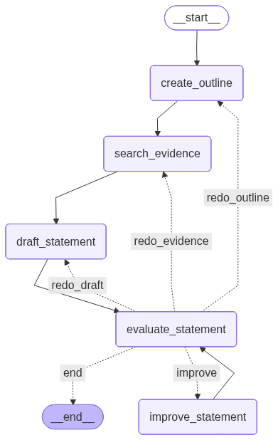

<!-- omit in toc -->
# llm-debate-assistant
基于大语言模型的辩论比赛备赛助手.

This project introduces an agentic, LLM-based debate assistant, designed to function as an autonomous partner in preparing for competitive debates

---
<!-- omit in toc -->
## Table of Contents
- [🚀 Getting Started](#-getting-started)
- [🔧 Pre-commit Hooks](#-pre-commit-hooks)
  - [Running Checks Manually](#running-checks-manually)
- [🏃 Run the App](#-run-the-app)
- [🔍 Observability \& Evaluation](#-observability--evaluation)
  - [Setup](#setup)
  - [Usage](#usage)
  - [Deep Preparation Agent](#deep-preparation-agent)
- [🤝 Contributing](#-contributing)
- [🗺️ Roadmap](#️-roadmap)
- [📚 Legacy Approaches](#-legacy-approaches)

## 🚀 Getting Started
This project uses `poetry` to manage dependencies

```bash
poetry config virtualenvs.in-project true
```


Then install the dependencies
```bash
poetry install
```

**Optional**: If you need audio/realtime features, install the audio dependencies:
```bash
# On macOS, install PortAudio first
brew install portaudio

# Then install with audio extras
poetry install --extras audio
```

Then activate the virtual environment
```bash
source .venv/bin/activate
```

---

## 🔧 Pre-commit Hooks

This project uses pre-commit hooks to ensure code quality and consistency. The following checks are enabled:

- **Code Formatting**: `ruff-format` for automatic Python code formatting
- **Linting**: `ruff` for fast, modern linting with auto-fix
- **Type Checking**: `mypy` for static type analysis
- **Security**: `detect-secrets` for preventing accidental credential commits
- **File Hygiene**: trailing whitespace removal, end-of-file fixer, YAML validation, and large file detection

### Running Checks Manually

Before committing, you can manually run all pre-commit checks to ensure your code passes:

```bash
pre-commit run --all-files
```

To run checks only on staged files (faster):

```bash
pre-commit run
```

To install the pre-commit hooks (runs automatically on commit):

```bash
pre-commit install
```

Alternatively, you can run the individual tools directly using Poetry:

```bash
# Format code with ruff
poetry run ruff format .

# Lint and auto-fix code with ruff
poetry run ruff check --fix .

# Type check with mypy
poetry run mypy src/
```

---

## 🏃 Run the App

To generate the debate content, you can either run the script:
```bash
python -m examples.run_debate
```
Or run the cells in the Jupyter notebook: [`notebook/scratchpad.ipynb`](notebook/scratchpad.ipynb).

To view the debate in the UI:
```bash
streamlit run frontend/app.py
```

> **Note**: to run the llms, set `is_demo=False` in `config.py`. Otherwise the demo UI will load the generated outputs from the previous run


---

## 🔍 Observability & Evaluation

This project uses [Comet Opik](https://www.comet.com/docs/opik/) for observability and evaluation of LLM interactions. Opik provides comprehensive tracking, monitoring, and evaluation capabilities for your debate assistant.

### Setup

1. Configure your Opik credentials in `~/.opik.config`:
```ini
[opik]
url_override = https://www.comet.com/opik/api/
workspace = your-workspace
api_key = your-api-key
```

2. For integration examples, see:
   - [Opik Documentation](https://www.comet.com/docs/opik/) - Integration guides for various model providers and agent frameworks

### Usage

There are two approaches to enable automatic logging:

**Option 1: Client-level tracking (Recommended)**

The OpenAI client is automatically tracked in `src/llm_debate_assistant/core/client.py`:

```python
from opik.integrations.openai import track_openai
from openai import OpenAI

client = OpenAI()
client = track_openai(client, project_name = "llm-debate-assistant")  # All API calls are now logged
```

With this approach, all LLM calls throughout your application are automatically logged without any decorators.

**Option 2: Function-level tracking**

You can also use decorators for more granular control or to track custom functions:

```python
import opik

@opik.track(project_name="llm-debate-assistant")
def your_function():
    # Your code here
    pass
```

**Option 3: LangGraph workflow tracking**

For LangGraph workflows (like the opening statement generator), use `OpikTracer` with callbacks:

```python
from opik.integrations.langchain import OpikTracer

workflow = create_debate_workflow()
opik_tracer = OpikTracer(
    graph=workflow.get_graph(xray=True),
    project_name="llm-debate-assistant"
)

result = await workflow.ainvoke(
    initial_state,
    config={"callbacks": [opik_tracer]}
)
```

This will automatically log all LLM calls within the workflow, including token usage, latency, and the workflow graph structure.

For examples, see:
- [`examples/client_logging.py`](examples/client_logging.py) - Client-level tracking
- [`examples/decorator_logging.py`](examples/decorator_logging.py) - Decorator-level tracking
- [`examples/simple_opening_statement_workflow.py`](examples/simple_opening_statement_workflow.py) - LangGraph workflow tracking

All LLM calls, inputs, outputs, and metadata are logged to Opik for observability.

What we log (short): latency, token counts, estimated cost, model + parameters, errors/tool usage, and optional tags (feature/experiment).

How to use traces/spans for evaluation:

- Use request spans to compute P50/P95 latency and spot slow endpoints.
- Aggregate token & cost per-feature or per-model to find expensive prompts and opportunities to optimize.
- Correlate spans with tags (feature, experiment) to compare model choices and measure quality vs. cost.
- Use traces to drive dashboards and alerts (latency spikes, cost anomalies, error rates).


---

### Deep Preparation Agent

The Deep Preparation system uses a **ReAct-style orchestrator** that autonomously manages debate preparation by invoking specialized subgraphs as tools.

**Architecture:**

- **Orchestrator Agent**: LLM-powered decision maker that determines which preparation steps to execute
- **Subgraph Tools**: Complete workflows wrapped as LangChain tools
  - `run_topic_research`: Research both sides, define key terms, identify strategic advantages
  - `run_constructive_speech`: Generate opening statement with evidence search and critique loop
  - `update_todo`: Track preparation progress with a managed task list
- **Modes**:
  - `lite` - Topic research only (faster, ~3-5 min)
  - `full` - Research + constructive speech (~10 min, more segments coming)

**How It Works:**

1. Agent receives the debate topic and side (正方/反方)
2. Creates a todo list with all required preparation tasks
3. Calls tools sequentially (research must complete before speech)
4. Each tool executes its own multi-step subgraph internally
5. Agent tracks progress and provides a final summary

**Tool Wrapping Pattern:**

Subgraphs are wrapped as tools using `@tool` decorator:
```python
@tool
async def run_topic_research(topic: str, side: Literal["正方", "反方"]) -> str:
    graph = create_topic_research_graph()
    app = graph.compile()
    final_state = await app.ainvoke(initial_state, config)
    return "✅ Research completed: [summary]"
```

The orchestrator uses LangGraph's `ToolNode` and `tools_condition` for the ReAct loop.

**Work in Progress:**

Additional segments under development:
- Rebuttal preparation（反驳，反反驳）
- Tactical exchange (自由辩, 质询) planning
- Closing statement（结辩）

See [`examples/orchestrator_example.py`](examples/orchestrator_example.py) for a complete example.

---

## 🤝 Contributing

**Code Quality:**
- Type hints required
- Run `pre-commit run --all-files` before committing
- Follow existing patterns in the codebase

**AI Coding Tools:**
AI assistants (Claude, Cursor, etc.) are welcome! Just make sure:
- Review and understand what you're committing
- Keep it simple and focused
- No AI slop (over-engineered, unnecessary abstractions, bloated code)

When in doubt: **less is more**.

---

## 🗺️ Roadmap
- litellm adapter
- Agents & other design patterns

---

## 📚 Legacy Approaches

<details>
<summary><b>Simple Reflection Pattern</b> (Legacy - click to expand)</summary>

> **Note:** This is a legacy implementation. For new projects, use the [Deep Preparation Agent](#deep-preparation-agent) instead.

For simpler use cases, the **Reflection Pattern** workflow provides a deterministic node-based approach.



The system employs an iterative refinement process with the following core nodes:

1. **Create Outline (create_outline)**
   - Generates argumentation framework based on debate topic and position
   - Includes keyword definitions, comparison standards, and three main arguments

2. **Search Evidence (search_evidence)**
   - Uses Google Search + Gemini to concurrently search for supporting evidence
   - Prioritizes authoritative sources, statistical data, and empirical cases

3. **Draft Statement (draft_statement)**
   - Generates complete opening statement based on outline and evidence
   - Ensures compliance with word limit (1200 characters) and conversational style

4. **Evaluate Statement (evaluate_statement)**
   - LLM evaluator assesses statement quality
   - Provides detailed feedback and improvement suggestions
   - **Smart Routing**: Decides next action based on problem type:
     - `redo_outline` - If argumentation framework has fundamental issues
     - `redo_evidence` - If evidence is insufficient or inappropriate
     - `redo_draft` - If writing quality needs improvement
     - `improve` - If only minor refinements needed

5. **Improve Statement (improve_statement)**
   - Makes targeted improvements based on feedback
   - Can invoke web search to supplement evidence

**Feedback-Driven Refinement:**

The system's core strength lies in **feedback awareness**:
- The evaluation node not only judges pass/fail but also provides specific improvement suggestions
- This feedback is automatically passed to the next generation node
- Whether redoing the outline, re-searching evidence, or rewriting the statement, the LLM references previous feedback

**Iteration Control:**
- `iteration_count` starts at 1 and increments after each evaluation
- `max_iterations` controls maximum number of evaluations (e.g., set to 3 for up to 3 evaluations)
- Flexible improvement strategy through conditional routing

**Running the Example:**

```bash
python examples/simple_opening_statement_workflow.py
```

For complete implementation, see:
- Workflow definition: [`src/llm_debate_assistant/agents/reflection_pattern/graph.py`](src/llm_debate_assistant/agents/reflection_pattern/graph.py)
- Node implementation: [`src/llm_debate_assistant/agents/reflection_pattern/nodes.py`](src/llm_debate_assistant/agents/reflection_pattern/nodes.py)
- Example runner: [`examples/simple_opening_statement_workflow.py`](examples/simple_opening_statement_workflow.py)

</details>
