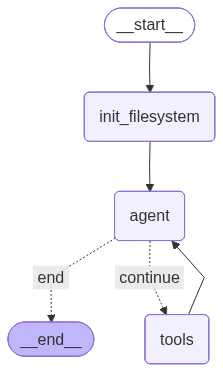

<!-- omit in toc -->
# llm-debate-assistant
基于大语言模型的辩论比赛备赛助手.

This project introduces an agentic, LLM-based debate assistant, designed to function as an autonomous partner in preparing for competitive debates

---
<!-- omit in toc -->
## Table of Contents
- [🚀 Getting Started](#-getting-started)
- [🔧 Pre-commit Hooks](#-pre-commit-hooks)
  - [Running Checks Manually](#running-checks-manually)
- [🏃 Run the App](#-run-the-app)
- [🔍 Observability \& Evaluation](#-observability--evaluation)
  - [Setup](#setup)
  - [Usage](#usage)
- [Agentic 辩论备赛](#agentic-辩论备赛-agentic-debate-preparation)
  - [Deep Preparation Agent](#deep-preparation-agent)
  - [Simple Reflection Pattern](#simple-reflection-pattern)
- [🗺️ Roadmap](#️-roadmap)

## 🚀 Getting Started
This project uses `poetry` to manage dependencies

```bash
poetry config virtualenvs.in-project true
```


Then install the dependencies
```bash
poetry install
```

**Optional**: If you need audio/realtime features, install the audio dependencies:
```bash
# On macOS, install PortAudio first
brew install portaudio

# Then install with audio extras
poetry install --extras audio
```

Then activate the virtual environment
```bash
source .venv/bin/activate
```

---

## 🔧 Pre-commit Hooks

This project uses pre-commit hooks to ensure code quality and consistency. The following checks are enabled:

- **Code Formatting**: `ruff-format` for automatic Python code formatting
- **Linting**: `ruff` for fast, modern linting with auto-fix
- **Type Checking**: `mypy` for static type analysis
- **Security**: `detect-secrets` for preventing accidental credential commits
- **File Hygiene**: trailing whitespace removal, end-of-file fixer, YAML validation, and large file detection

### Running Checks Manually

Before committing, you can manually run all pre-commit checks to ensure your code passes:

```bash
pre-commit run --all-files
```

To run checks only on staged files (faster):

```bash
pre-commit run
```

To install the pre-commit hooks (runs automatically on commit):

```bash
pre-commit install
```

Alternatively, you can run the individual tools directly using Poetry:

```bash
# Format code with ruff
poetry run ruff format .

# Lint and auto-fix code with ruff
poetry run ruff check --fix .

# Type check with mypy
poetry run mypy src/
```

---

## 🏃 Run the App

To generate the debate content, you can either run the script:
```bash
python -m examples.run_debate
```
Or run the cells in the Jupyter notebook: [`notebook/scratchpad.ipynb`](notebook/scratchpad.ipynb).

To view the debate in the UI:
```bash
streamlit run frontend/app.py
```

> **Note**: to run the llms, set `is_demo=False` in `config.py`. Otherwise the demo UI will load the generated outputs from the previous run


---

## 🔍 Observability & Evaluation

This project uses [Comet Opik](https://www.comet.com/docs/opik/) for observability and evaluation of LLM interactions. Opik provides comprehensive tracking, monitoring, and evaluation capabilities for your debate assistant.

### Setup

1. Configure your Opik credentials in `~/.opik.config`:
```ini
[opik]
url_override = https://www.comet.com/opik/api/
workspace = your-workspace
api_key = your-api-key
```

2. For integration examples, see:
   - [Opik Documentation](https://www.comet.com/docs/opik/) - Integration guides for various model providers and agent frameworks

### Usage

There are two approaches to enable automatic logging:

**Option 1: Client-level tracking (Recommended)**

The OpenAI client is automatically tracked in `src/llm_debate_assistant/core/client.py`:

```python
from opik.integrations.openai import track_openai
from openai import OpenAI

client = OpenAI()
client = track_openai(client, project_name = "llm-debate-assistant")  # All API calls are now logged
```

With this approach, all LLM calls throughout your application are automatically logged without any decorators.

**Option 2: Function-level tracking**

You can also use decorators for more granular control or to track custom functions:

```python
import opik

@opik.track(project_name="llm-debate-assistant")
def your_function():
    # Your code here
    pass
```

**Option 3: LangGraph workflow tracking**

For LangGraph workflows (like the opening statement generator), use `OpikTracer` with callbacks:

```python
from opik.integrations.langchain import OpikTracer

workflow = create_debate_workflow()
opik_tracer = OpikTracer(
    graph=workflow.get_graph(xray=True),
    project_name="llm-debate-assistant"
)

result = await workflow.ainvoke(
    initial_state,
    config={"callbacks": [opik_tracer]}
)
```

This will automatically log all LLM calls within the workflow, including token usage, latency, and the workflow graph structure.

For examples, see:
- [`examples/client_logging.py`](examples/client_logging.py) - Client-level tracking
- [`examples/decorator_logging.py`](examples/decorator_logging.py) - Decorator-level tracking
- [`examples/simple_opening_statement_workflow.py`](examples/simple_opening_statement_workflow.py) - LangGraph workflow tracking

All LLM calls, inputs, outputs, and metadata are logged to Opik for observability.

What we log (short): latency, token counts, estimated cost, model + parameters, errors/tool usage, and optional tags (feature/experiment).

How to use traces/spans for evaluation:

- Use request spans to compute P50/P95 latency and spot slow endpoints.
- Aggregate token & cost per-feature or per-model to find expensive prompts and opportunities to optimize.
- Correlate spans with tags (feature, experiment) to compare model choices and measure quality vs. cost.
- Use traces to drive dashboards and alerts (latency spikes, cost anomalies, error rates).


---
## Agentic 辩论备赛 (Agentic Debate Preparation)

This project uses **LangGraph** to implement autonomous debate preparation agents. The system can independently generate, evaluate, and refine debate content until it meets competitive standards. While currently focused on opening statements, the architecture is designed to scale to all debate rounds.

### Deep Preparation Agent

The **Deep Preparation Agent** is an autonomous workflow that handles complete opening statement preparation with intelligent tool selection and task management.

#### Why "Deep"?

The name references the emerging concept of **Deep Agents** - agentic systems that can handle complex, multi-step tasks requiring sustained reasoning and context management. Unlike simple ReAct loops, deep agents need sophisticated strategies for:
- Managing context across many tool calls
- Maintaining coherent plans over extended interactions
- Efficiently utilizing limited context windows

See [Philipp Schmid's Deep Agents](https://www.philschmid.de/agents-2.0-deep-agents) and [LangChain's Deep Agents](https://blog.langchain.com/deep-agents/) for background on this paradigm.

> **Note on Context Isolation**: We have not yet implemented full context isolation (separate contexts for different sub-tasks). Currently, we use a single shared context with selective state building. Full isolation would allow sub-agents to work independently without polluting each other's context, but adds complexity in context merging and coordination. This is planned for future iterations as we scale to more debate rounds.



#### Context Engineering Techniques

Managing context efficiently is critical for deep agents. We employ several techniques:

1. **Filesystem-based Context Management**
   - Artifacts (outline, evidence, drafts) are saved to disk after creation
   - State fields are cleared to `None` after saving (e.g., `return {"outline": None}`)
   - Subsequent nodes load from filesystem instead of carrying data in state
   - Reduces token usage by ~60-70% for long-running workflows

2. **Selective State Building**
   - Each tool handler receives only the state keys it needs
   - `build_selective_state(state, ["topic", "side", "filesystem"])` instead of full state
   - Prevents irrelevant context from inflating prompts

3. **Feedback Summarization**
   - Long evaluation feedback (>500 chars) is summarized before adding to message history
   - Uses a separate LLM call to extract 3-5 key action items
   - Logs compaction metrics: `[Compaction] 1200 chars → 350 chars (71% reduction)`

4. **Dynamic System Prompts**
   - System prompt is rebuilt on every agent call with current task list
   - Old system messages are filtered out to prevent accumulation
   - Task progress is always visible without history bloat

5. **Token Usage Tracking**
   - Tracks input/output tokens per call and cumulatively
   - Helps identify expensive operations for optimization
   - Logged with `[Agent Output] This call: X input, Y output`

**Key Features:**
- **Autonomous Decision Making**: Agent decides which tools to call and when
- **Task Planning**: Creates and tracks todos throughout the workflow
- **Automatic Improvement Loop**: Iteratively refines drafts based on evaluation feedback

**Available Tools:**
- `create_outline_tool` - Generate argumentation framework
- `search_evidence_tool` - Search for supporting evidence
- `draft_statement_tool` - Write opening statement
- `evaluate_statement_tool` - Assess quality and provide feedback
- `improve_statement_tool` - Refine based on feedback
- `write_todos_tool` / `mark_todo_complete_tool` - Task management
- `read_file_tool` / `write_file_tool` - Filesystem operations

**Running the Example:**
```bash
python examples/deep_preparation_example.py
```

For implementation, see:
- Agent workflow: [`src/llm_debate_assistant/agents/deep_preparation/`](src/llm_debate_assistant/agents/deep_preparation/)
- Example runner: [`examples/deep_preparation_example.py`](examples/deep_preparation_example.py)

---

### Simple Reflection Pattern

For simpler use cases, the **Reflection Pattern** workflow provides a deterministic node-based approach.


The system employs an iterative refinement process with the following core nodes:

1. **Create Outline (create_outline)**
   - Generates argumentation framework based on debate topic and position
   - Includes keyword definitions, comparison standards, and three main arguments

2. **Search Evidence (search_evidence)**
   - Uses Google Search + Gemini to concurrently search for supporting evidence
   - Prioritizes authoritative sources, statistical data, and empirical cases

3. **Draft Statement (draft_statement)**
   - Generates complete opening statement based on outline and evidence
   - Ensures compliance with word limit (1200 characters) and conversational style

4. **Evaluate Statement (evaluate_statement)**
   - LLM evaluator assesses statement quality
   - Provides detailed feedback and improvement suggestions
   - **Smart Routing**: Decides next action based on problem type:
     - `redo_outline` - If argumentation framework has fundamental issues
     - `redo_evidence` - If evidence is insufficient or inappropriate
     - `redo_draft` - If writing quality needs improvement
     - `improve` - If only minor refinements needed

5. **Improve Statement (improve_statement)**
   - Makes targeted improvements based on feedback
   - Can invoke web search to supplement evidence

### Feedback-Driven Intelligent Refinement

The system's core strength lies in **feedback awareness**:

- The evaluation node not only judges pass/fail but also provides specific improvement suggestions
- This feedback is automatically passed to the next generation node
- Whether redoing the outline, re-searching evidence, or rewriting the statement, the LLM references previous feedback

**Example**:
```python
# Evaluation feedback: "论点二缺少具体数据支持，需要查找关于远程工作对生产力影响的量化研究"
# (Argument 2 lacks concrete data support, need to find quantitative research on remote work's impact on productivity)

# When routing to search_evidence, the search query automatically includes:
"""
【评审反馈】
论点二缺少具体数据支持，需要查找关于远程工作对生产力影响的量化研究

请根据以上反馈，寻找更合适的证据。
"""
```

### Iteration Control

- `iteration_count` starts at 1 and increments after each evaluation
- `max_iterations` controls maximum number of evaluations (e.g., set to 3 for up to 3 evaluations)
- Flexible improvement strategy through conditional routing

### Running the Example

```bash
python examples/simple_opening_statement_workflow.py
```

For complete implementation, see:
- Workflow definition: [`src/llm_debate_assistant/agents/reflection_pattern/graph.py`](src/llm_debate_assistant/agents/reflection_pattern/graph.py)
- Node implementation: [`src/llm_debate_assistant/agents/reflection_pattern/nodes.py`](src/llm_debate_assistant/agents/reflection_pattern/nodes.py)
- Example runner: [`examples/simple_opening_statement_workflow.py`](examples/simple_opening_statement_workflow.py)

---

## 🗺️ Roadmap
- litellm adapter
- Agents & other design patterns
