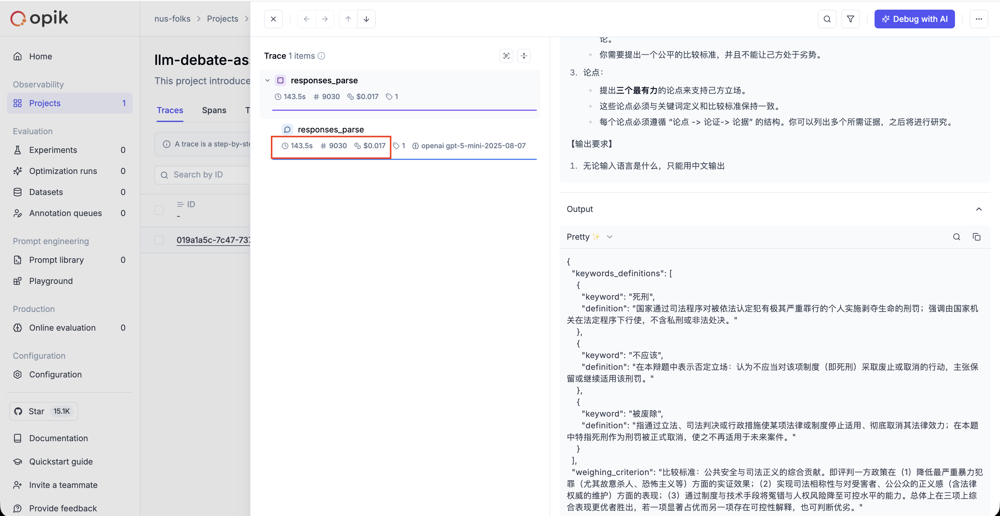

<!-- omit in toc -->
# llm-debate-assistant
基于大语言模型的辩论比赛备赛助手.

This project introduces an agentic, LLM-based debate assistant, designed to function as an autonomous partner in preparing for competitive debates

---
<!-- omit in toc -->
## Table of Contents
- [🚀 Getting Started](#-getting-started)
- [🔧 Pre-commit Hooks](#-pre-commit-hooks)
  - [Running Checks Manually](#running-checks-manually)
- [🏃 Run the App](#-run-the-app)
- [� Observability \& Evaluation](#-observability--evaluation)
  - [Setup](#setup)
  - [Usage](#usage)
- [🗺️ Roadmap](#️-roadmap)

## 🚀 Getting Started
This project uses `poetry` to manage dependencies

```bash
poetry config virtualenvs.in-project true
```


Then install the dependencies
```bash
poetry install
```

**Optional**: If you need audio/realtime features, install the audio dependencies:
```bash
# On macOS, install PortAudio first
brew install portaudio

# Then install with audio extras
poetry install --extras audio
```

Then activate the virtual environment
```bash
source .venv/bin/activate
```

---

## 🔧 Pre-commit Hooks

This project uses pre-commit hooks to ensure code quality and consistency. The following checks are enabled:

- **Code Formatting**: `black` and `isort` for automatic Python code formatting
- **Code Quality**: `ruff` for fast, modern linting
- **File Hygiene**: trailing whitespace removal, end-of-file fixer, YAML validation, and large file detection

### Running Checks Manually

Before committing, you can manually run all pre-commit checks to ensure your code passes:

```bash
pre-commit run --all-files
```

To run checks only on staged files (faster):

```bash
pre-commit run
```

To install the pre-commit hooks (runs automatically on commit):

```bash
pre-commit install
```

Alternatively, you can run the individual tools directly using Poetry:

```bash
# Format code with black
poetry run black .

# Sort imports with isort
poetry run isort .

# Lint and auto-fix code with ruff
poetry run ruff check --fix .

# Format docstrings with docformatter
poetry run docformatter --in-place --recursive .
```

---

## 🏃 Run the App

To generate the debate content, you can either run the script:
```bash
python -m examples.run_debate
```
Or run the cells in the Jupyter notebook: [`notebook/scratchpad.ipynb`](notebook/scratchpad.ipynb).

To view the debate in the UI:
```bash
streamlit run frontend/app.py
```

> **Note**: to run the llms, set `is_demo=False` in `config.py`. Otherwise the demo UI will load the generated outputs from the previous run


---

## � Observability & Evaluation

This project uses [Comet Opik](https://www.comet.com/docs/opik/) for observability and evaluation of LLM interactions. Opik provides comprehensive tracking, monitoring, and evaluation capabilities for your debate assistant.

### Setup

1. Configure your Opik credentials in `~/.opik.config`:
```ini
[opik]
url_override = https://www.comet.com/opik/api/
workspace = your-workspace
api_key = your-api-key
```

2. For integration examples, see:
   - [Opik Documentation](https://www.comet.com/docs/opik/) - Integration guides for various model providers and agent frameworks

### Usage

There are two approaches to enable automatic logging:

**Option 1: Client-level tracking (Recommended)**

The OpenAI client is automatically tracked in `src/llm_debate_assistant/core/client.py`:

```python
from opik.integrations.openai import track_openai
from openai import OpenAI

client = OpenAI()
client = track_openai(client, project_name = "llm-debate-assistant")  # All API calls are now logged
```

With this approach, all LLM calls throughout your application are automatically logged without any decorators.

**Option 2: Function-level tracking**

You can also use decorators for more granular control or to track custom functions:

```python
import opik

@opik.track(project_name="llm-debate-assistant")
def your_function():
    # Your code here
    pass
```

For examples, see [`examples/client_logging.py`](examples/client_logging.py) (client-level) and [`examples/decorator_logging.py`](examples/decorator_logging.py) (decorator-level).

All LLM calls, inputs, outputs, and metadata are logged to Opik for observability.

What we log (short): latency, token counts, estimated cost, model + parameters, errors/tool usage, and optional tags (feature/experiment).

How to use traces/spans for evaluation:

- Use request spans to compute P50/P95 latency and spot slow endpoints.
- Aggregate token & cost per-feature or per-model to find expensive prompts and opportunities to optimize.
- Correlate spans with tags (feature, experiment) to compare model choices and measure quality vs. cost.
- Use traces to drive dashboards and alerts (latency spikes, cost anomalies, error rates).



---

## 🗺️ Roadmap
- litellm adapter
- Agents & other design patterns
